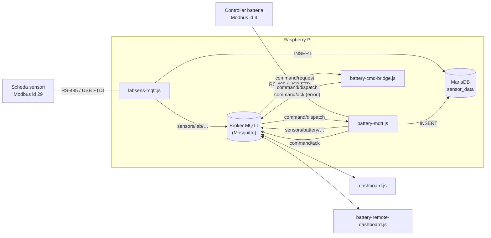

# Architettura e funzionamento interno

Questo documento descrive come è organizzato il software, come circolano i dati e come si comporta ciascun componente, inclusa la gestione degli errori.

- [Panoramica](#panoramica)
- [Flussi dei dati](#flussi-dei-dati)
- [Stack tecnologico](#stack-tecnologico)
- [labsens-mqtt.js — sensori di laboratorio](#labsens-mqttjs--sensori-di-laboratorio)
- [battery-mqtt.js — controller batteria](#battery-mqttjs--controller-batteria)
- [battery-cmd-bridge.js — bridge dei comandi](#battery-cmd-bridgejs--bridge-dei-comandi)
- [modbus-autodetect.js — rilevamento automatico delle porte](#modbus-autodetectjs--rilevamento-automatico-delle-porte)
- [Dashboard](#dashboard)
- [Resilienza e gestione degli errori](#resilienza-e-gestione-degli-errori)

---

## Panoramica



Il sistema è composto da **tre processi di servizio** indipendenti (eseguiti come unità systemd) e **due client interattivi**. I processi non comunicano mai direttamente tra loro: l'unico canale condiviso è il **broker MQTT**. Questo li rende avviabili, riavviabili e sostituibili in modo indipendente.

Ogni dispositivo Modbus è collegato a un **proprio adattatore USB-seriale** e gestito da **un solo processo**: la porta seriale viene aperta in modo esclusivo, quindi due processi non possono condividerla.

## Flussi dei dati

### 1. Acquisizione (telemetria)

```
dispositivo ──Modbus──► servizio ──┬──► MQTT  (un topic per grandezza + eventuale topic aggregato)
                                   └──► MariaDB (una riga per ciclo)
```

A ogni tick del timer di polling (default 1 s) il servizio legge un blocco di registri, li converte in grandezze fisiche, e in parallelo pubblica su MQTT e inserisce una riga nel database.

### 2. Comandi al controller batteria

```
client ──► sensors/battery/command/request
               │
               ▼
      battery-cmd-bridge.js   (validazione)
               │ ok                          │ errore
               ▼                             ▼
  sensors/battery/command/dispatch    sensors/battery/command/ack  (status: error)
               │
               ▼
        battery-mqtt.js   (decodifica → scrittura registro → rilettura stato)
               │
               ├──► sensors/battery/state (+ topic singoli)  stato aggiornato
               ├──► MariaDB                                  riga con lo stato aggiornato
               └──► sensors/battery/command/ack              status: ok | error
```

Il flusso è a **due stadi**:

- il **bridge** fa una validazione "di forma" (JSON valido, comando ammesso, `commandId` presente, valori interi, range di `run`) e rifiuta subito le richieste malformate senza toccare la linea seriale;
- il **servizio batteria** decodifica il comando nel registro da scrivere, esegue la scrittura Modbus, rilegge immediatamente lo stato e conferma l'esito.

Il campo `commandId` scelto dal client viene riportato in ogni ACK e permette di correlare risposta e richiesta.

## Stack tecnologico

| Elemento | Scelta |
|---|---|
| Runtime | Node.js ≥ 20.6, moduli ES (`"type": "module"`) |
| Configurazione | variabili d'ambiente caricate con `node --env-file=.env` (nessuna libreria `dotenv`) |
| Modbus | [`modbus-serial`](https://www.npmjs.com/package/modbus-serial) ^8, modalità RTU bufferizzata (`connectRTUBuffered`) |
| MQTT | [`mqtt`](https://www.npmjs.com/package/mqtt) ^5 |
| Database | [`mariadb`](https://www.npmjs.com/package/mariadb) ^3.4, pool di 5 connessioni |
| Gestione processi | systemd (`Restart=always`) |

Non ci sono passi di build: i file `.js` vengono eseguiti direttamente.

---

## labsens-mqtt.js — sensori di laboratorio

Classe principale: `LabSensorsBridge`.

### Sequenza di avvio

1. Verifica che `MARIADB_PASSWORD` sia impostata; altrimenti termina con codice 1.
2. **Modbus**: `openModbus()` chiama `findModbusPort()` (vedi [autodetect](#modbus-autodetectjs--rilevamento-automatico-delle-porte)) cercando il dispositivo con indirizzo `LABSENS_MODBUS_ADDRESS` (default 29) usando il registro 64 come sonda; poi apre la porta trovata e imposta indirizzo slave e timeout.
3. **MQTT**: connessione con `mqtt.connectAsync()`.
4. **MariaDB**: `setupDatabase()`
   - apre una connessione senza database e crea il database se non esiste (`CREATE DATABASE IF NOT EXISTS`);
   - crea un pool di connessioni sul database;
   - crea la tabella se non esiste (schema in [riferimento.md](riferimento.md#tabella-labsens_measurements)).
5. Esegue subito un primo ciclo di polling, poi avvia un `setInterval` con periodo `LABSENS_POLL_INTERVAL`.
6. Registra gli handler di `SIGINT`/`SIGTERM` per l'arresto ordinato.

Se uno qualsiasi dei passi 2–4 fallisce il processo termina con codice 1 e, se gestito da systemd, viene riavviato dopo 5 s.

### Ciclo di polling (`poll()`)

1. Se il ciclo precedente è ancora in corso, il tick viene saltato (flag `isPolling`): i cicli non si sovrappongono mai.
2. Legge **in sequenza** (mai in parallelo, per non far collidere le richieste sulla linea):
   - blocco registri **64–69** (6 registri) → ogni valore diviso per **100**;
   - registro **34** (NTC) → valore diviso per **10**.
3. Se una delle due letture fallisce, il ciclo viene scartato (nulla viene pubblicato né salvato) e si incrementa il contatore di errori consecutivi (vedi [resilienza](#resilienza-e-gestione-degli-errori)).
4. Se entrambe riescono, azzera il contatore e in parallelo:
   - pubblica 6 messaggi su `sensors/lab/<grandezza>`;
   - pubblica 1 messaggio su `sensors/lab/ntc/temperature`;
   - inserisce una riga in `labsens_measurements`.

I messaggi MQTT dei sensori di laboratorio **non** sono `retain`: un client che si collega vede i valori solo dal ciclo successivo.

### Lettura con fallback (`readRegistersWithFallback`)

Ogni lettura prova prima la funzione Modbus **03 (Read Holding Registers)**; se fallisce, ritenta con la funzione **04 (Read Input Registers)**. Questo rende il software compatibile con firmware che espongono gli stessi dati nell'una o nell'altra area.

Ogni lettura è inoltre protetta da un timeout globale (`Promise.race`) pari a `2 × timeout Modbus + 500 ms`, cioè abbastanza lungo da coprire il caso peggiore in cui entrambe le richieste (03 e 04) vanno in timeout.

---

## battery-mqtt.js — controller batteria

Classe principale: `BatteryBridge`. La struttura ricalca quella di `labsens-mqtt.js`, con in più la gestione dei comandi.

### Sequenza di avvio

1. Verifica `MARIADB_PASSWORD`.
2. Connessione Modbus con autodetect (indirizzo `BATTERY_MODBUS_ADDRESS`, default 4; registro sonda 0 = versione firmware).
3. Connessione MQTT e registrazione dell'handler dei messaggi.
4. Setup MariaDB (database + tabella `battery_measurements`).
5. Sottoscrizione a `sensors/battery/command/dispatch` (QoS 1).
6. **Lettura delle informazioni del controller** (registri 0, 1, 8, 13: firmware, indirizzo, codice dispositivo, baud rate) e pubblicazione `retain` su `sensors/battery/meta`. Se questa lettura fallisce il servizio non parte (codice di uscita 1) e systemd lo riavvia.
7. Primo polling immediato, poi `setInterval` ogni `BATTERY_POLL_INTERVAL`.

### Ciclo di polling

1. Salta il tick se il precedente è ancora in corso.
2. Legge il blocco **400–405** (6 registri) in un'unica richiesta.
3. Converte correnti e tensioni da 16 bit senza segno a **16 bit con segno** (così una corrente di scarica può essere negativa) e decodifica lo stato di marcia (`0` stopped, `1` charge, `2` discharge).
4. In parallelo:
   - pubblica lo stato completo su `sensors/battery/state` e ogni grandezza su un topic dedicato (tutti `retain`);
   - inserisce una riga in `battery_measurements`.

### Serializzazione dell'accesso al bus (`withModbusLock`)

Nel servizio batteria due attività possono voler usare la seriale contemporaneamente: il polling periodico e l'esecuzione di un comando arrivato via MQTT. Per evitare richieste sovrapposte, ogni operazione Modbus passa da una **coda basata su Promise** (`modbusQueue`): ciascuna operazione parte solo quando la precedente è terminata (con successo o con errore). Un errore non blocca la coda. Il nome dell'operazione (es. `read-battery state block 400-405`, `write-reg-400`) viene prefissato ai messaggi d'errore per facilitare la diagnosi.

### Esecuzione di un comando (`handleCommand`)

1. Il payload ricevuto su `command/dispatch` viene interpretato come JSON; se non è valido si pubblica un ACK d'errore.
2. `decodeCommand()` traduce il comando nel registro e nel valore da scrivere:

   | Comando | Registro | Vincoli |
   |---|---|---|
   | `set_current_ma` | 400 | intero |
   | `set_voltage_mv` | 401 | intero |
   | `set_run_state` | 404 | `0`, `1` o `2` |
   | `write_register` | `register` del payload | intero |

3. Il valore viene convertito in 16 bit senza segno: sono ammessi valori da **−32768 a 65535**; i negativi vengono scritti in complemento a due.
4. Scrittura con funzione Modbus **06 (Write Single Register)**, attraverso la coda.
5. Rilettura immediata dello stato (blocco 400–405).
6. In parallelo: pubblicazione dello stato aggiornato, salvataggio su DB e ACK `status: "ok"`.
7. Qualsiasi errore nei passi 2–6 produce un ACK `status: "error"` con il messaggio d'errore.

---

## battery-cmd-bridge.js — bridge dei comandi

Processo leggero, senza accesso a Modbus né al database.

- Si collega al broker con un `clientId` casuale (`battery-cmd-bridge-xxxxxx`), sessione pulita e riconnessione automatica ogni 3 s.
- A ogni (ri)connessione si sottoscrive a `sensors/battery/command/request` (QoS 1).
- Per ogni messaggio:
  - JSON non valido → il messaggio viene **scartato solo con un log** (non è possibile inviare un ACK correlato);
  - payload non valido (vedi regole sotto) → ACK `status: "error"` con `handledBy: "battery-cmd-bridge"`;
  - payload valido → ripubblicato su `sensors/battery/command/dispatch` (QoS 1, non `retain`) con l'aggiunta dei campi `forwardedBy` e `forwardedAt`.

Regole di validazione:

1. il payload deve essere un oggetto JSON;
2. `command` deve essere uno fra `set_current_ma`, `set_voltage_mv`, `set_run_state`, `write_register`;
3. `commandId` è **obbligatorio** e deve essere una stringa non vuota;
4. `write_register` richiede `register` e `value` interi;
5. gli altri comandi richiedono `value` intero;
6. `set_run_state` accetta solo `0`, `1`, `2`.

Il bridge non conosce i registri né i limiti fisici del controller: quella parte è responsabilità di `battery-mqtt.js`.

---

## modbus-autodetect.js — rilevamento automatico delle porte

Entrambi i dispositivi usano adattatori USB-seriale dello stesso modello (FTDI), quindi il nome del file di dispositivo non basta a distinguerli, e l'ordine `ttyUSB0`/`ttyUSB1` può cambiare a ogni avvio. Il modulo risolve il problema **interrogando ogni porta** e cercando quella a cui risponde l'indirizzo Modbus desiderato.

### API

```js
isAutoPort(port)          // true se port è vuoto/undefined o "auto" (case-insensitive)

findModbusPort({
  label,          // nome usato nei log ("labsens", "battery")
  address,        // indirizzo slave Modbus cercato
  baudRate,
  probeRegister,  // registro letto per verificare la presenza del dispositivo
  preferredPort,  // porta da provare per prima (opzionale)
  timeout = 500,  // ms per ogni richiesta di sonda
  attempts = 10,  // tentativi complessivi
  retryDelay = 2000
}) // → Promise<string> con il percorso della porta, oppure rifiuta
```

### Algoritmo

Per ogni tentativo (fino a `attempts`):

1. Elenca le voci di `/dev/serial/by-id/` e le **mescola in ordine casuale**.
2. Se è indicata una `preferredPort` esplicita, la sposta in testa.
3. Per ogni porta:
   - prova ad aprirla; se l'apertura fallisce (tipicamente perché **un altro servizio la tiene già aperta**) la porta è marcata `busy`;
   - imposta l'indirizzo slave e legge 1 registro `probeRegister` con funzione 03;
   - se la risposta è un **timeout**, nessun dispositivo con quell'indirizzo è presente → porta scartata;
   - se è un altro errore (es. eccezione Modbus), riprova con la funzione 04; se questa riesce il dispositivo è considerato trovato;
   - chiude sempre la porta prima di proseguire.
4. Se nessuna porta risponde, attende `retryDelay × (0.5…1.5)` (ritardo casuale) e ricomincia.

Dopo l'ultimo tentativo fallito la funzione lancia un errore; con i valori di default la ricerca dura quindi fino a ~20–40 s prima di arrendersi.

L'ordine casuale e il ritardo casuale evitano che due servizi avviati nello stesso momento continuino a "scontrarsi" provando ciascuno la porta occupata dall'altro.

### Quando viene eseguito

- all'avvio del servizio;
- ogni volta che la porta risulta chiusa (`ensureModbusConnected`), per esempio dopo una disconnessione USB o dopo la chiusura forzata causata da troppi errori consecutivi.

Nelle ricerche successive alla prima viene provata per prima l'ultima porta su cui il dispositivo era stato trovato.

---

## Dashboard

Entrambe le dashboard sono client MQTT puri: **non** accedono né a Modbus né al database, quindi possono girare su qualsiasi macchina che raggiunga il broker.

### dashboard.js

- Sottoscrive `sensors/lab/#` (QoS 1).
- Mantiene in memoria l'ultimo valore ricevuto per ciascun topic.
- Ridisegna lo schermo a ogni messaggio e comunque ogni secondo.
- Per ogni grandezza mostra valore, unità, una barra colorata proporzionale al valore nell'intervallo min–max predefinito (verde < 50 %, giallo < 80 %, rosso oltre) e l'ora dell'ultimo aggiornamento.
- Un valore più vecchio di 15 s viene segnato come `(stale)`.

### battery-remote-dashboard.js

- Sottoscrive `sensors/battery/state`, `sensors/battery/meta` e `sensors/battery/command/ack` (QoS 1). Poiché stato e meta sono `retain`, i dati compaiono subito alla connessione.
- Mostra stato della batteria, informazioni del controller, ultimo ACK.
- Offre un prompt (`cmd>`) per inviare comandi, che vengono pubblicati su `sensors/battery/command/request` con un `commandId` generato automaticamente.
- Per non cancellare quello che l'utente sta digitando, il ridisegno dello schermo viene rimandato finché la riga di input non è vuota.

---

## Resilienza e gestione degli errori

| Situazione | Comportamento |
|---|---|
| Timeout o errore in una singola lettura | Il ciclo viene scartato; si riprova al tick successivo. |
| `LABSENS_MAX_FAILURES` / `BATTERY_MAX_FAILURES` (default 10) cicli falliti consecutivi | La porta seriale viene chiusa di proposito; alla lettura successiva parte un nuovo **autodetect** (utile se l'adattatore è stato scollegato e ricollegato, o i dispositivi sono stati scambiati di porta). |
| Errore `Port Not Open` durante una lettura | Tentativo immediato di riconnessione prima del fallback alla funzione 04. |
| Porta chiusa / dispositivo scollegato | `ensureModbusConnected()` rilancia l'autodetect; più chiamate concorrenti condividono la stessa riconnessione. |
| Dispositivo non trovato all'avvio | Il processo termina (exit 1) e systemd lo riavvia dopo 5 s. |
| Broker MQTT temporaneamente irraggiungibile | La libreria `mqtt` si riconnette automaticamente. Durante l'interruzione le pubblicazioni restano in coda nel client e, poiché il ciclo di polling attende il loro completamento, i tick successivi possono essere saltati finché la connessione non torna. |
| Broker irraggiungibile **all'avvio** dei servizi di acquisizione | La connessione iniziale fallisce, il processo termina, systemd lo riavvia. |
| Errore di scrittura su MariaDB | Nel servizio labsens viene solo registrato nel log e il ciclo prosegue; nel servizio batteria fa fallire il ciclo (e conta come errore consecutivo). |
| `SIGINT` / `SIGTERM` | Arresto ordinato: stop del timer, chiusura di MQTT, Modbus e pool MariaDB. |
